# 众策通 ZhongceTong

**科创政策智能管家 · Policy Intelligence Hub**

> 政策数据平台卖「你该报什么」；众策通卖「你怎么把它报成」。
> 前者是资讯工具，后者是生产系统。
>
> Policy data platforms tell you what you *could* apply for.
> ZhongceTong runs the process of actually getting it approved.

面向科技政策咨询机构 / 高新技术企业认定服务机构的**生产系统**。

---

## 中文

```
【众策通 ZhongceTong 发布】把政策咨询做成一条生产线

政策咨询行业有个尴尬的现状：
政策数据平台已经卷到百万条量级，但机构内部的日常作业，
还停留在 Excel + 微信群。

我们决定不去卷数据量，而是补上中间那一层——
咨询机构的生产系统。

▍它替你把五件事做掉

1. 政策库自动采集 + 规则化入库，一键跑「客户 × 政策」匹配，
   直接给出可报清单与差距项
2. 申报条件结构化，逐条比对，明确输出「达标 / 不达标 / 缺数据」三态
3. 客户档案按企业归集，缺失字段在列表里直接标「待补录」
4. 项目台账 + 22 种阶段状态 + 风险列，进度与风险一屏可见
5. 按模板生成诊断报告 / 合同预览（Word），下载后本地改，改完回传归档

▍四个我们不愿意妥协的地方

· 本地部署，数据不出域
  全栈私有化，应用 / 推理 / 存储都在内网，凭据 AES-256 加密

· IP–RD–PS 证据链
  知识产权、研发项目、高新技术产品作为独立档案体系并建立映射，
  申报书与成果转化证明自动引用，不靠人工核对

· 可解释、不臆造
  每条判定保留政策原文口径（如「占销售收入 2%-6%」），可溯源；
  AI 遇到未覆盖的问题明确拒答，不用通识或训练数据编企业信息

· AI 可管控
  影响清单 → 二次确认 → 全程留痕 → 可撤销

▍三个角色，三套界面

· 管理员：指挥中心 / 智能体管理 / 系统管理与审计
· 顾问：客户、政策、项目、文档一条线
· 客户：自助查看进度、上传资料，减少来回沟通

▍中英双语

界面全站中英文双语，`?lang=en` 可直接分享英文链接给海外团队。

系统已跑通完整闭环：
新客户接入 → 政策匹配 → 项目立项 → 文档生成 → 合同与回款。

演示 / 联系：【待填】

#众策通 #ZhongceTong #科技政策 #高企认定 #政策咨询数字化
```

## English

```
Introducing ZhongceTong (众策通) — Policy Intelligence Hub

A production system for science & technology funding consultancies.

THE GAP

Policy databases have already scaled to millions of records.
But how consultancies actually do the work hasn't moved past spreadsheets and group chats.

We didn't try to win on data volume. We built the missing middle layer.

WHAT IT REPLACES

· Policy library, auto-collected and rule-structured — one click runs
  client × policy matching and returns a reportable list plus the specific gaps
· Eligibility criteria structured and checked line by line — met / unmet / data missing
· Client profiles organised per company, missing fields flagged "to be backfilled"
· Project ledger with 22 stage states and a risk column
· Diagnosis reports and contract previews generated from templates (Word),
  edited locally, then filed back

FOUR THINGS WE WON'T COMPROMISE

· On-premise, data never leaves your network
  Full stack inside your intranet; credentials AES-256 encrypted at rest

· IP–RD–PS evidence chain
  Intellectual property, R&D projects and high-tech products managed as
  separate record systems with explicit mappings, auto-referenced in filings

· Explainable, never fabricated
  Every verdict keeps the original policy wording, so it stays traceable;
  the AI refuses rather than guesses when the answer isn't in the library

· Governable AI
  Impact list → second confirmation → full audit trail → revertible

THREE ROLES, THREE INTERFACES

· Admin — command center, agent management, system audit
· Consultant — clients, policies, projects, documents in one line
· Client — self-service progress tracking and document upload

FULLY BILINGUAL

Chinese and English across the entire UI. Share an English link with ?lang=en.

The end-to-end loop is live and verified:
onboard client → match policies → open project → generate documents → contract & payment.

Demo / contact: [TBD]

#ZhongceTong #PolicyIntelligence #GovTech #OnPremise
```

---

## 四个支点 / Four pillars

| | |
|---|---|
| 本地部署，数据不出域 | On-premise, data never leaves your network — full stack, AES-256 encrypted credentials |
| IP–RD–PS 证据链 | IP / R&D projects / high-tech products as separate record systems with explicit mappings |
| 可解释、不臆造 | Explainable, never fabricated — every verdict keeps the original policy wording |
| AI 可管控 | Governable AI — impact list, second confirmation, full audit trail, revertible |

## 推文全文 / Full posts

- [中文推文 `tweets-zh.md`](tweets-zh.md) — T1–T6，含 X / 微博 短版
- [English posts `tweets-en.md`](tweets-en.md) — E1–E6, with X-length variants

## 发布前必读 / Before publishing

1. **不要声称政策库体量** —— 实际条数远小于竞品（百万条级），主动提数据量是自曝短板。
   Do not claim policy-library size.
2. **不公开内部建议价** —— ¥68,000 / ¥9,800 均为未经商业确认的建议价。
   Do not publish internal suggested pricing.
3. **不使用「云」字** —— 与「本地部署、数据不出域」定位直接冲突。
   Never use the word "cloud" in Chinese copy.
4. **替换占位符** —— 正文中的【待填】/ [TBD] 共 2 处（演示链接、联系方式）。
   Replace the 2 placeholders before posting.

## 产品截图 / Screenshots

### 登录 / 主界面

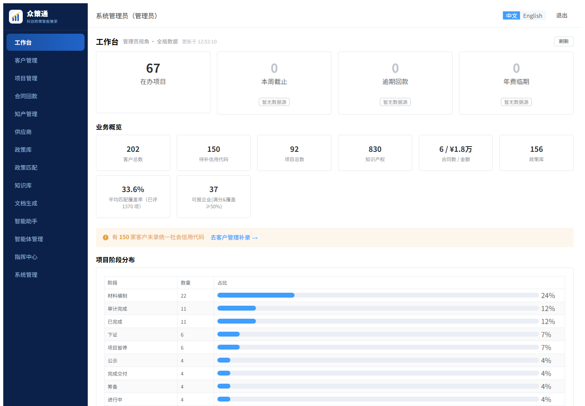

### 工作台


### 客户管理

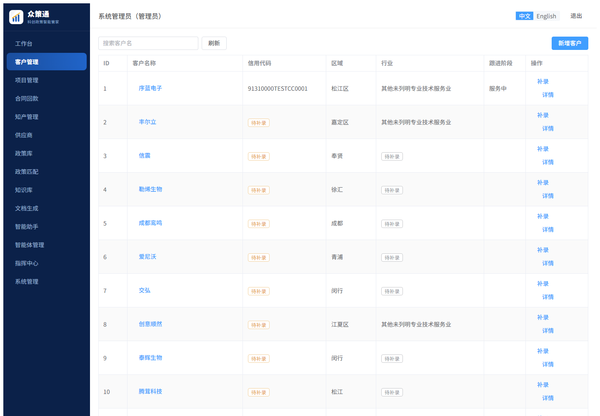

### 政策智能匹配

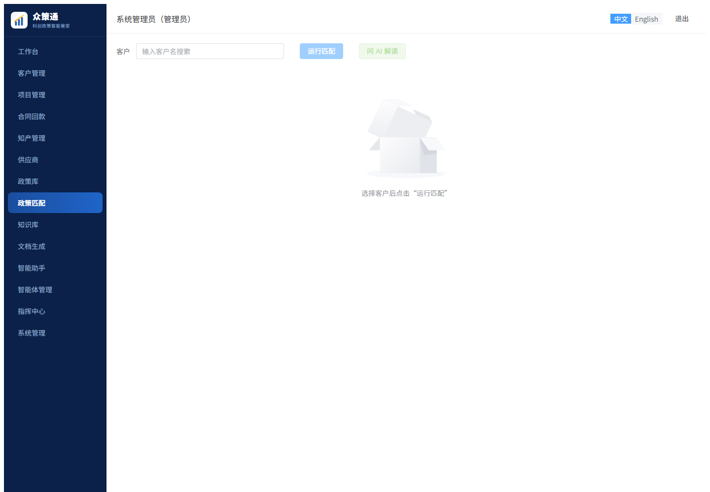

### 匹配结果：可报 / 口径较粗 / 规则数

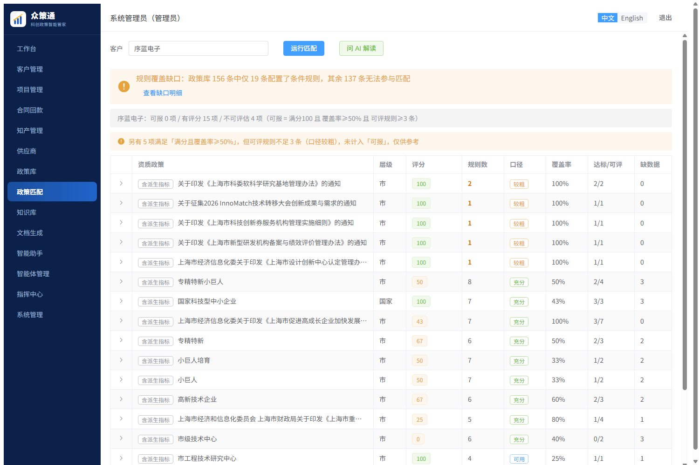

### 政策详情

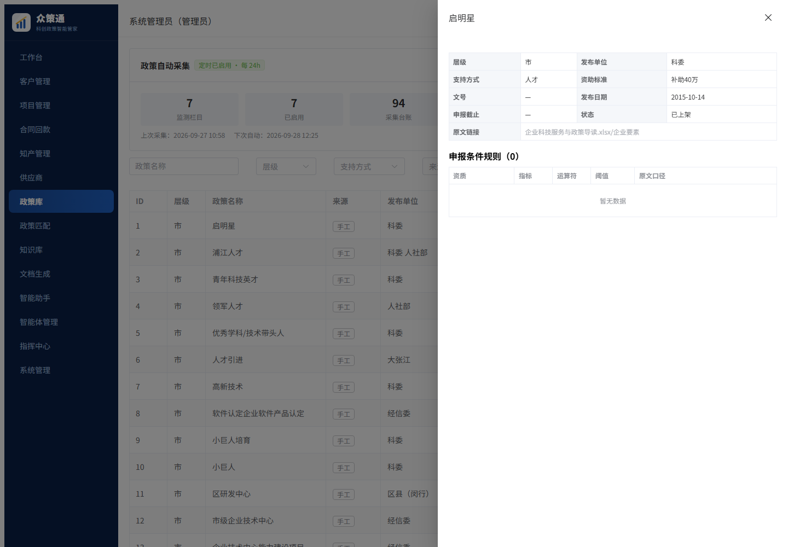

### 项目台账

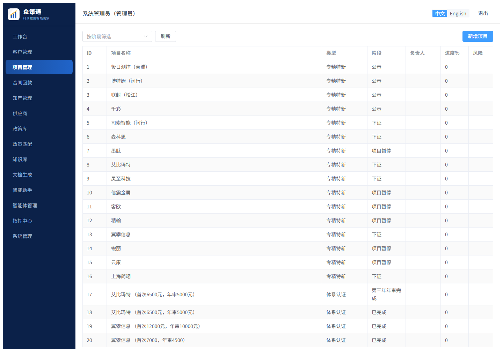

### 文档生成

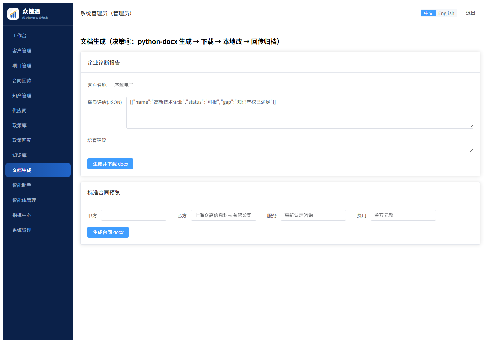

### 指挥中心：写操作影响清单

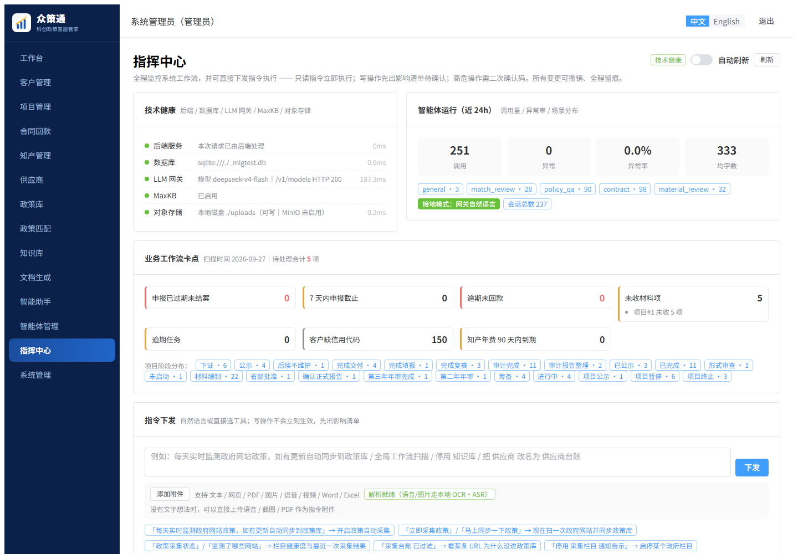

### AI 解读匹配结果

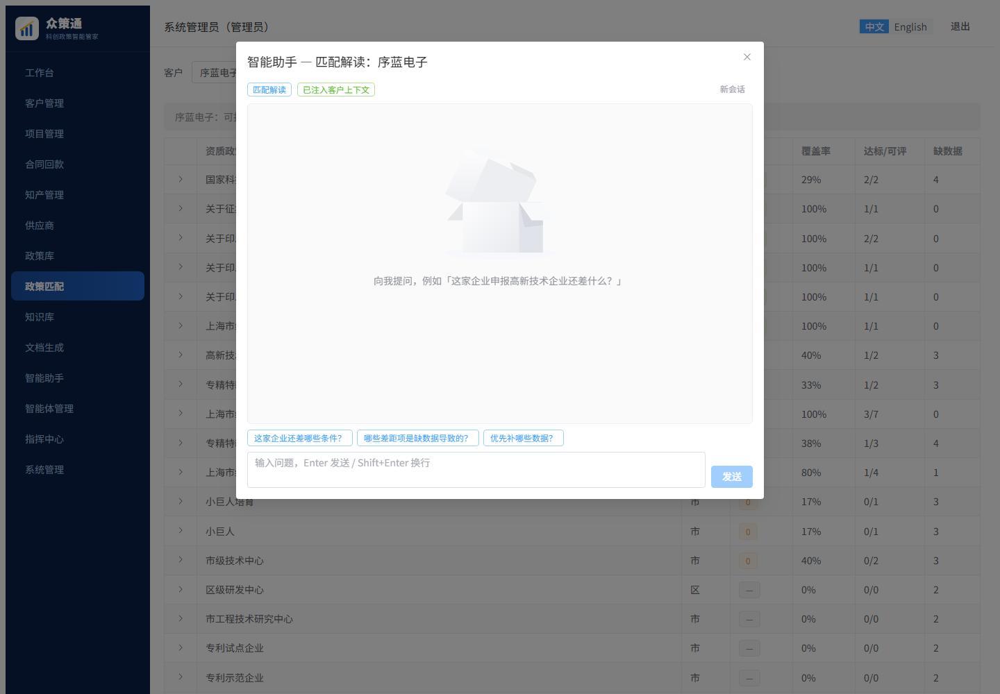

### 审计日志

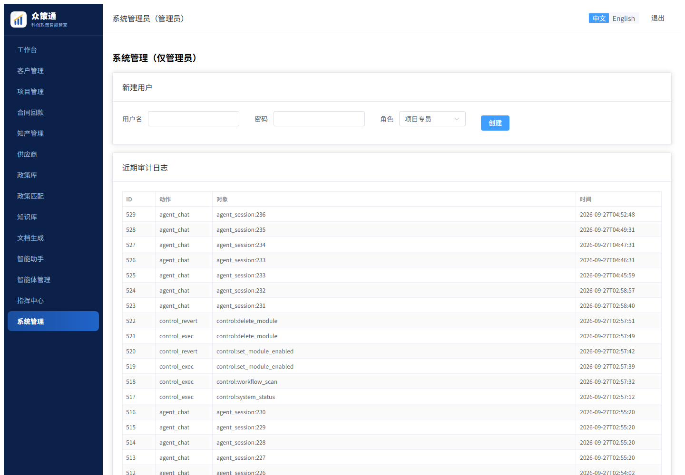

### 客户档案完整度

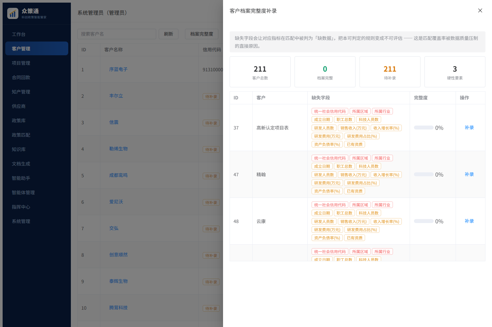

### 客户端门户

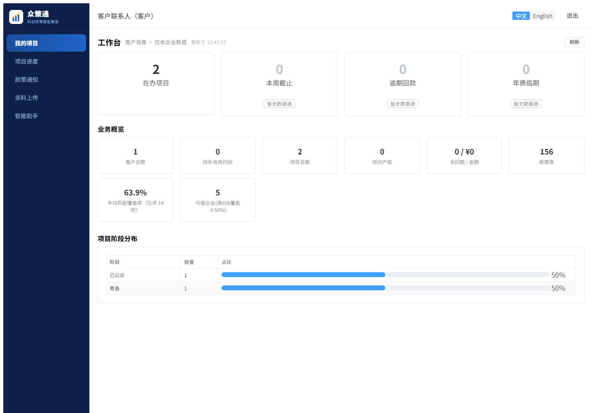

### 英文界面

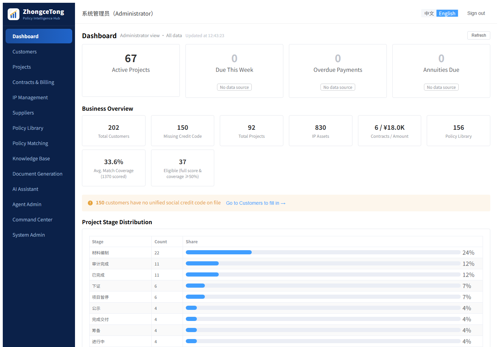


> 截图取自真实运行系统，未做美化处理。
